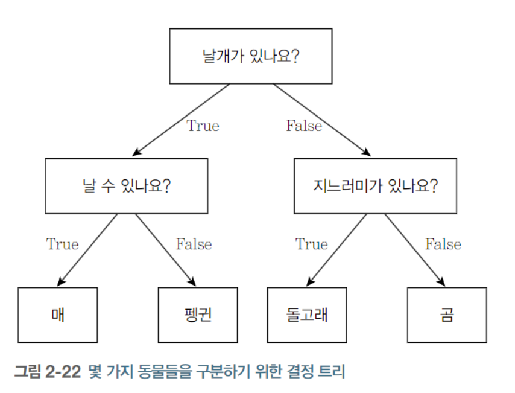

# 02 지도학습

## 2.1 분류와 회귀

지도학습

- 지도학습은 분류와 회귀로 나눌수 있다

- 분류(classification)
  - 미리 정의된, 가능성이 있는 클래스 레이블 중 하나를 예측하는 것
  - 이진 분류(binary classification): 두 개의 클래스로 분류
    - ex. 스팸 메일 분류
  - 자둥 분류(multiclass classification): 셋 이상의 클래스로 분류
    - ex. 붓꽃 분류기
  - 출력 값에 연속성이 없다
- 회귀(regression)
  - 연속적인 숫자, 부동소수점(실수)를 예측하는 것
  - ex. 교육 수준, 나이, 주거지를 바탕으로 연간 소득을 예측하는 것
  - 출력 값에 연속성이 있다

## 2.2 일반화, 과대적합, 과소적합

일반화(generalization)

- 모델이 **처음 보는 데이터에 대해 정확하게 예측**할 수 있으면, 훈련 세트에서 테스트 세트로 일반화가 되었다고 한다
- 훈련 세트에 맞는 복잡한 모델을 만드는 경우, 훈련 세트에"만" 정확한 모델이 될 수 있다

과대적합과 과소적합

- 과대적합(overfitting): 가진 정보를 모두 사용해서 너무 복잡한 모델을 만드는 것
- 과소적합(underfitting): 데이터의 다양성을 반영하지 않고 너무 간단한 모델을 만드는 것

우리가 찾는 모델은 "일반화 성능"이 최대가 되는 최적점에 있는 모델이다


### 2.2.1 모델 복잡도와 데이터셋 크기의 관계

모델의 복잡도는 훈련 데이터셋에 담긴 입력 데이터의 다양성과 관련이 깊다

다양한 데이터 포인터가 많을수록 과대적합 없이 더 복잡한 모델을 만들 수 있다.

## 2.3 지도 학습 알고리즘

### 2.3.1 예제에 사용할 데이터셋

데이터셋을 사용하기 위한 준비

```py
# mglearn 패키지를 설치
%pip install mglearn

# import packages
import mglearn
import matplotlib.pyplot as plt

```

forge 데이터셋

- 인위적으로 만든 이진 분류 데이터셋
- 특성 2개와 26개의 포인터를 갖는다

```py

X, y = mglearn.datasets.make_forge()
mglearn.discrete_scatter(X[:, 0], X[:, 1], y)
plt.legend(["클래스 0", "클래스 1"], loc=4)
plt.xlabel("첫 번째 특성")
plt.ylabel("두 번째 특성")

print("X.shape:", X.shape)
# X.shape: (26, 2)
```


wave 데이터셋

- 회귀 알고리즘
- 입력 특성 하나와 모델링할 타깃 변수(또는 응답)을 가진다
- 특성을 x축에 놓고 회귀의 타깃(출력)을 y축에 놓는다

```py
# wave 데이터셋
# 회귀 알고리즘에 사용

X, y = mglearn.datasets.make_wave(n_samples=40)
plt.plot(X, y, 'o')
plt.ylim(-3, 3)
plt.xlabel("Features")
plt.ylabel("Target")
```


scikit-learn의 cancer 데이터셋

- 각 종양은 양성과 악성으로 레이블되어 있고
- 조직 데이터를 기반으로 종양이 악성인지 예측할수 있도록 학습하는 것이 과제

```py
from sklearn.datasets import load_breast_cancer
cancer = load_breast_cancer()
print("cancer.keys():\n", cancer.keys())

# cancer.keys():
# dict_keys(['data', 'target', 'frame', 'target_names', 'DESCR', 'feature_names', 'filename', 'data_module'])
```

scikit-learn에 포함된 데이터셋은 Bunch 객체에 저장되어 있다.

- 딕셔너리와 비슷하지만 점표기법 사용가능
- bunch['key'] 대신 bunch.key 사용 가능

```py
# 569개의 데이터 포인트
# 30개의 특성

print("유방암 데이터의 형태", cancer.data.shape)

# Output
# 유방암 데이터의 형태 (569, 30)
```

```py
# 569 개 데이터 포인터 중
# 212 개는 악성이고
# 357 개는 양성이다

print("클래스별 샘플 개수:\n", {
  n: v for n, v in zip(cancer.target_names, np.bincount(cancer.target))
})

# Output
# 클래스별 샘플 개수:
#  {'malignant': 212, 'benign': 357}
```

```py
# feature_names 속성: 각 특성의 의미를 알 수 있다
print("특성 이름:\n", cancer.feature_names)

# 특성 이름:
#  ['mean radius' 'mean texture' 'mean perimeter' 'mean area'
#  'mean smoothness' 'mean compactness' 'mean concavity'
#  'mean concave points' 'mean symmetry' 'mean fractal dimension'
#  'radius error' 'texture error' 'perimeter error' 'area error'
#  'smoothness error' 'compactness error' 'concavity error'
#  'concave points error' 'symmetry error' 'fractal dimension error'
#  'worst radius' 'worst texture' 'worst perimeter' 'worst area'
#  'worst smoothness' 'worst compactness' 'worst concavity'
#  'worst concave points' 'worst symmetry' 'worst fractal dimension']
```

보스턴 주택 가격

- 회귀 분석용 실제 데이터셋
- 범죄율, 찰스강 인접도, 고속도로 접근성 등의 정보를 이용해 1970 년대 보스턴 주변의 주택 평균 가격을 예측
- 506 포인트와 13 특성이 있다

```py
# 보스턴 주택 가격 데이터셋
data_url = "http://lib.stat.cmu.edu/datasets/boston"
raw_df = pd.read_csv(data_url, sep="\s+", skiprows=22, header=None)
data = np.hstack([raw_df.values[::2, :], raw_df.values[1::2, :2]])
target = raw_df.values[1::2, 2]
print("데이터의 형태:", data.shape)

# Output
# 데이터의 형태: (506, 13)
```

확장된 데이터셋

- 13개의 입력특성 외에도 특성끼리 곱하여 (= 상호작용) 의도적으로 확장 하였다 = 특성 공학(feature engineering)
- 13 + 91 = 104

```py
X, y = mglearn.datasets.load_extended_boston()
print("X.shape:", X.shape)

# Output
# X.shape: (506, 104)
```

### 2.3.2 k-최근접 이웃

- K-NN; k-Nearest Neighbors
- 가장 간단한 머신러닝 알고리즘
- 훈련 데이터트를 그냥 저장하는 것이 모델을 만드는 과정의 전부이다
- 새로운 데이터 포인트에 예측을 할 때 알고리즘이 훈련 데이터셋에서 가장 가까운 포인트, 즉 '최근접 이웃'을 찾는다

**k-최근접 이웃 분류**

- 가장 가까운 훈련 데이터 포인트를 하나를 최근접 이웃으로 찾아 예측에 사용

```py
# forge 데이터셋
mglearn.plots.plot_knn_classification(n_neighbors=1)
```


- 데이터 포인트 3개를 추가 (별)
- 추가한 데이터에 가장 가까운 훈련 데이터 포인터를 연결
- 1-KNN 알고리즘의 예측은 이 데이터의 레이블이 된다

하나가 아닌 임의의 k개를 선택할 수 있다

- 둘 이상의 이웃을 선택할 때는 레이블을 정하기 위한 투표를 한다
- 클래스 별로 속한 이웃이 몇 개인지 세알리고, 이웃이 많은 클래스를 레이블로 지정한다

```py
mglearn.plots.plot_knn_classification(n_neighbors=3)
```


클래스가 많은 경우에도 이웃에 포함된 클래스의 갯수를 세알려 가장 많은 클래스를 예측값으로 사용한다

**scikit-learn을 사용하여 k-NN 알고리즘 적용**

```py
# 일반화 성능을 평가할 수 있도록 데이터를 훈련 세트와 테스트 세트로 나눔
from sklearn.model_selection import train_test_split
X, y = mglearn.datasets.make_forge()

X_train, X_test, y_train, y_test = train_test_split(X, y, random_state=0)

# KNeighborsClassifier 클래스를 임포트하고 객체를 만든다
# 이웃의 수 같은 매개변수를 지정한다
from sklearn.neighbors import KNeighborsClassifier
clf = KNeighborsClassifier(n_neighbors=3)

# 훈련 세트를 사용하여 분류 모델을 학습시킨다
# KNeighborsClassifier 학습: 예측할 때 이웃을 찾을 수 있도록 데이터를 저장
clf.fit(X_train, y_train)

# 테스트 데이터에 대해 predict 메서드를 호출하여 예측한다
# 각 데이터 포인트에 대해 훈련 세트에서 가장 가까운 이웃을 계산한 다음 가장 많은 데이터를 찾는다
print("테스트 세트 예측:", clf.predict(X_test))
# Output
# 테스트 세트 예측: [1 0 1 0 1 0 0]

# 일반화 평가
# score 메서드에 테스트 데이터와 테스트 레이블을 넣어 호출한다
print("테스트 세트 정확도: {:.2f}".format(clf.score(X_test, y_test)))
# Output
# 테스트 세트 정확도: 0.86
# 86% 정확도; 모델이 테스트 데이터셋에 있는 샘플 중 86%를 정확히 예측하였다
```

**KNeighborsClassifier 분석**

- 2차원 데이터셋이므로 가능한 모든 테스트 포인트의 예측을 xy 평면에 그려볼 수 있다
- 각 데이터 포인트에 속한 클래스에 따라 평면을 칠하면 지정한 영역으로 나뉘는 결정 경계 (decision boundary)를 볼 수 있다.

```py
# Decision boundary
fig, axes = plt.subplots(1, 3, figsize=(10, 3))

for n_neighbors, ax in zip([1, 3, 9], axes):
  # fit: sef 오브젝트를 리턴
  # 객체 생성과 fot 메서드를 한줄에 쓸 수 있다
  clf = KNeighborsClassifier(n_neighbors=n_neighbors).fit(X, y)
  # 결정 경계
  mglearn.plots.plot_2d_separator(clf, X, fill=True, eps=0.5, ax=ax, alpha=.4)
  # 분산도
  mglearn.discrete_scatter(X[:, 0],X[:,1], y,ax=ax)
  # 타이틀 & 레전드
  ax.set_title("{} Neighbor".format(n_neighbors))
  ax.set_xlabel("Feature 0")
  ax.set_ylabel("Feature 1")

axes[0].legend(loc=3)
```


- 이웃 1: 훈련 데이터에 가깝다 -> 복잡도가 올라가고
- 이웃 9: 경계가 부드러워 진다 -> 복잡도가 낮아진다

**유방암 데이터셋을 사용하여 모델의 복잡도와 일반화 사이의 관계를 입증**

```py
# 1. 테스트 세트와 훈련 세트를 나누고
# 2. 이웃수를 달리하여 훈련 세트와 테스트 세트의 성능을 평가

from sklearn.model_selection import train_test_split
from sklearn.datasets import load_breast_cancer
from sklearn.neighbors import KNeighborsClassifier
import matplotlib.pyplot as plt

cancer = load_breast_cancer()
X_train, X_test, y_train, y_test = train_test_split(cancer.data, cancer.target, stratify=cancer.target, random_state=66)
# stratify: 기존 데이터를 나누는 것에 그치는 게 아니라, 클래스 분포 비율까지 맞춰준다
# Stratified sampling: 훈련데이터를 나눌 때 무작위로 샘플링을 하되, 클래스 비율이 train, test 세트에도 동일하게 유지되는 것을 보장한다
# https://hyjykelly.tistory.com/44

training_accurary = []
test_accuracy = []

# 1 에서 10 까지 n_neighbors 를 적용
neighbors_settings = range(1, 10)

for n_neighbors in neighbors_settings:
  # 모델 생성
  clf = KNeighborsClassifier(n_neighbors=n_neighbors)
  clf.fit(X_train, y_train)
  # 훈련 세트 정확도 저장
  training_accurary.append(clf.score(X_train, y_train))
  # 일반화 정확도 저장
  test_accuracy.append(clf.score(X_test, y_test))

plt.plot(neighbors_settings, training_accurary, label="training accurary")
plt.plot(neighbors_settings, test_accuracy, label="test accuracy")
plt.ylabel("Accurary")
plt.ylabel("n_neighbors")
plt.legend()
```


- n_neighbors 수에 따른 훈련 세트와 테스트 세트 정확도
- 과대적합: 이웃의 수가 적을 수록 모델이 복잡해지고
- 과소적합: 이웃이 많을 수록 모델이 단순해진다
- 정확도가 가장 좋을 때: n_neighbors = 6

**k-최근접 이웃 회귀**

KNN 알고리즘은 회귀 분석에서도 사용 할 수 있다

1-KNN

- 가장 가까운 타깃이 예측 값

```py
mglearn.plots.plot_knn_regression(n_neighbors=1)
```


3-KNN

- 여러 개의 최근접 이웃을 사용할 때 이웃 간의 평균이 예측 된다

```py
mglearn.plots.plot_knn_regression(n_neighbors=3)
```


KNeighborsRegressor

- scikit-learn 에 구현된 회귀를 위한 KNN 알고리즘

```py
from sklearn.neighbors import KNeighborsRegressor

X, y = mglearn.datasets.make_wave(n_samples=40)

# wave 데이터셋을 훈련 세트와 테스트 세트로 나눈다
X_train, X_test, y_train, y_test = train_test_split(X, y, random_state=0)

# 이웃의 수를 3으로 하여 모델의 객체를 만든다
reg = KNeighborsRegressor(n_neighbors=3)

# 훈련 데이터와 타깃을 사용하여 모델을 학습시킨다
reg.fit(X_train, y_train)

# 테스트 세트에 대해 예측을 한다
print("테스트 세트 예측:\n", reg.predict(X_test))

# Output
# 테스트 세트 예측:
# [-0.05396539  0.35686046  1.13671923 -1.89415682 -1.13881398 -1.63113382  0.35686046  0.91241374 -0.44680446 -1.13881398]

# score 메서드를 사용하여 모델을 평가할 수 있다
# 회귀 일떄 R^2 를 반환 (0 ~ 1)
# 1: 예측이 완벽한 경우
# 0: 훈련 세트의 출력값인 y_train의 평균으로만 예측하는 모델
# 음수: 예측과 타깃이 상반되는 경향을 가지는 경우

print("테스트 세트 R^2: {:.2f}".format(reg.score(X_test, y_test)))

# Output
# 테스트 세트 R^2: 0.83
```

**KNeighborsRegressor 분석**

1차원 데이터셋에 대해 가능한 모든 특성 값을 만들어 예측해볼 수 있다

```py
# KNeighborsRegressor 분석

fig, axes = plt.subplots(1, 3, figsize=(15, 4))
# -3 과 3 사이에 1000 개의 데이터 포인트를 만든다

line = np.linspace(-3, 3, 1000).reshape(-1,1)
# numpy.reshape
# Gives a new shape to an array without changing its data.

for n_neighbors, ax in zip([1,3,9], axes):
  # 1, 3, 9 이웃을 사용한 예측을 한다
  reg = KNeighborsRegressor(n_neighbors=n_neighbors)
  reg.fit(X_train, y_train)
  ax.plot(line, reg.predict(line))
  ax.plot(X_train, y_train, '^', c=mglearn.cm2(0), markersize=8)
  ax.plot(X_test, y_test, 'v', c=mglearn.cm2(1), markersize=8)

  ax.set_title(
    "{} neighbors Training Score: {:.2f} Test Score: {:.2f}".format(n_neighbors, reg.score(X_train, y_train), reg.score(X_test, y_test))
  )

  ax.set_xlabel("Features")
  ax.set_ylabel("Targets")

axes[0].legend(["Model Predict", "Training Data/Target", "Test Data/Target"], loc="best")
```


- N:1: 훈련 세트의 각 데이터 포인트가 예측에 주는 영향이 커서 예측값이 훈련 데이터 포인트를 모두 지나간다 (불안전한 예측)
- N:9: 훈련 데이터에는 잘 안 맞을 수 있지만 더 안정적 예측을 얻게 된다

**장단점과 매개변수**

KNeighbors 분류기의 매개변수

- 데이터 포인트 사이의 거리를 재는 방법
  - 기본적으로 유클리디안 거리 방식을 사용
  - 이웃 간의 거리를 계산할 때 특성마다 값의 범위가 다르면 범위가 작은 특정에 크게 영향을 받는다. 따라서 k-NN 알고리즘을 사용할 때는 같은 스케일을 갖도록 정규화하는 것이 일반 적이다
- 이웃의 수: 3~5개 정도로 적을 대 잘 작동하지만, 조정이 필요하다

KNN 장점

- 이해하기 쉽고, 많이 조정하지 않아도 자주 좋은 성능을 발휘한다
- 복잡한 알고리즘을 적용해보기 전에 시도해볼만 하다

KNN 단점

- 빠르게 만들 수 있지만, 훈련 세트가 애무 크면 (특성 수, 샘플 수) 예측이 느려진다
- 데이터 전처리 과정이 중요하다
- 수백 개 이상의 많은 특성을 가진 데이터셋에는 잘 동작하지않으며
- 특성 값이 대부분 0인 데이터셋과는 잘 작동하지 않는다

결론: KNN 알고리즘은 이해하기 쉽지만 예측이 느리고 많은 특성을 처리하는 능력이 부족해 현업에서는 잘 쓰지 않는다

### 2.3.3 선형 모델

선형 모델은 입력 특성에 대한 "선형 함수"를 만들어 예측을 수행한다

**회귀의 선형 모델**

선형 모델을 위한 일반화된 예측 함수


- x[0] ~ x[p]
  - 하나의 데이터 포인트에 대한 특성
  - 특성의 개수: p + 1
- w, b: 모델이 학습할 파라미터 (모델 파라미터, 계수)
  - 반대로, 사람이 직접 설정해 주어야하는 파라미터: 하이퍼파리미터, 매개변수
- y: 모델이 만들어낸 예측값

특성이 하나인 경우


- w[0]: 기울기
- b: 절펀
- 특성이 많아지만 w는 각 특성에 해당하는 기울기를 모두 가진다
- 예측값: 입력 특성에 w의 각 가중치를 곱해서 더한 가중치 합

wave 데이터셋으로 파라미터 w[0]와 b를 직선처럼 되도록 학습

```py
mglearn.plots.plot_linear_regression_wave()
```


회귀를 위한 선형 모델은 특성이 1개이면 직선, 2개이면 평면, 3개이면 초평면이되는 회귀 모델의 특징을 가지고 있다.

훈련 데이터보다 특성이 더 많은 경우엔 타깃 y도 완벽하게 (훈련 세트에 대해서) 선형 함수로 모델할 수 있다

회귀를 위한 선형 모델은 훈련 데이터로부터 모델 파라미터 w와 b를 학습하는 방법과 모델의 복잡도를 제어하는 방법이서 차이가 난다.

**선형 회귀(최소 제곱법)**

선형 회귀(linear regression) 또는 최소 제곱법(OLS, ordinary least squares)

- 예측과 훈련 세트에 있는 타깃 y 사이의 평균제곱오차를 최소화하는 파라미터 w와 b를 찾는다
- 평균제곱오차: 예측값과 타깃 값의 차이를 제곱하여 더한 후 샘플의 개수로 나눈 것
  
- 매개변수가 없는 것이 장점이지만, 모델의 복잡도를 제어할 방법도 없다

선형 모델을 만드는 코드

```py
from sklearn.linear_model import LinearRegression
X, y = mglearn.datasets.make_wave(n_samples=60)
X_train, X_test, y_train, y_test = train_test_split(X, y, random_state=42)

lr = LinearRegression().fit(X_train, y_train)

# w (weight/coefficient) = lr.coef_
# b (offset/intercept) = lr.intercept_

print("lr.coef_", lr.coef_)
print("lr.intercept_", lr.intercept_)

# output
# lr.coef_ [0.39390555]
# lr.intercept_ -0.031804343026759746
```

- 학습된 선형 회귀 모델은 w 파라미터와 b 파라미터를 속성에 저장하고 있다
- w
  - 가중치(weight), 계수(coefficient)
  - `lr.coef_`
  - 각 입력 특성에 하나씩 대응되는 NumPy 배열
- b:
  - 편향(offset), 절편(intercept)
  - `lr.intercept_`
  - 항상 실수 값 하나

훈련 세트와 테스트 세트의 성능 확인

```py
# 훈련 세트와 테스트 세트의 성능 확인
print("훈련 세트 점수: {:.2f}".format(lr.score(X_train, y_train)))
print("테스트 세트 점수: {:.2f}".format(lr.score(X_test, y_test)))

# Output
# 훈련 세트 점수: 0.67
# 테스트 세트 점수: 0.66
```

R^2 = 0.66

- 낮은 점수 & 훈련 세트와 테스트 세트의 점수가 비슷
- 과소적합 상태를 의심할 수 있다

과대적합

- 1차원 데이터셋: 모델이 단순하므로 과대적합을 고려할 필요 X
- 고차원 데이터셋: 선형 모델의 성능이 매우 높아져 과대적합될 가능성이 높다

보스턴 주택가격 데이터셋 (샘플 506, 특성 104) + LinearRegression 모델

```py
# 데이터셋 읽기
X, y = mglearn.datasets.load_extended_boston()

# 훈련/테스트 세트 스플릿
X_train, X_test, y_train, y_test = train_test_split(X, y, random_state=0)

# 선형 모델 학습
lr = LinearRegression().fit(X_train, y_train)

# 점수 비교 (R^2)
print("훈련 세트 점수: {:.2f}".format(lr.score(X_train, y_train)))
print("테스트 세트 점수: {:.2f}".format(lr.score(X_test, y_test)))

# Output
# 훈련 세트 점수: 0.95
# 테스트 세트 점수: 0.61
```

R^2

- 훈련 세트에는 예측이 매우 정확한 반면 테스트 세트에서는 예측이 매우 낮다
- 과대적합을 의심할 수 있으며, 복잡도를 제어할 수 있는 모델을 사용해야 한다

**리지 회귀**

가중치(w)의 절대값을 가능한 한 작게 만든다

- = 모든 특성이 출력에 주는 영향을 최소한으로 만든다
- = 규제(Regularization)
  - 과대적합이 되지 않도록 모델을 강제로 제한한다
  - L2 규제
    - 리지 회귀에 사용하는 규제 방식
    - 수학적으로 리지는 계수의 L2 노름(norm)의 제곱을 패널티로 적용한다

보스턴 주택가격 데이터셋 + 리지 회귀(`linear_model.Ridge`)

```py
# 보스턴 주택가격 데이터셋 + 리지 회귀(`linear_model.Ridge`)
from sklearn.linear_model import Ridge

# 리지 모델 학습
ridge = Ridge().fit(X_train, y_train)

# R^2 점수 조회
print("훈련 세트 점수: {:.2f}".format(ridge.score(X_train, y_train)))
print("테스트 세트 점수: {:.2f}".format(ridge.score(X_test, y_test)))

# Output
# 훈련 세트 점수: 0.89
# 테스트 세트 점수: 0.75
```

훈련 세트 점수는 선형 회귀 보다 낮아 졌지만. 테스트 세트 점수는 더 높아 졌다.

- Ridge 모델이 덜 자유로운 모델이기 때문에 과대적합이 적어진다.
- 모델의 복잡도가 낮아지면서, 훈련 세트에서 성능은 나빠지지만, 더 일반화된 모델이 된다

alpha 매개변수

- 훈련 세트의 성능 대비 모델을 얼마나 단순화할지 지정할 수 있다
- 기본값: 1.0
- alpha 값을 높이면 계수를 0에 더 가깝게 만들어 훈련 세트의 성능은 나빠지지만 일반화에는 도움을 줄 수 있다
- alpha 값을 줄여 테스트 세트에 대한 성능을 높일 수 있다

```py
# alpha 값이 10일 때 성능

ridge10 = Ridge(alpha=10).fit(X_train, y_train)
print("훈련 세트 점수: {:.2f}".format(ridge10.score(X_train, y_train)))
print("테스트 세트 점수: {:.2f}".format(ridge10.score(X_test, y_test)))

# Output
# 훈련 세트 점수: 0.79
# 테스트 세트 점수: 0.64

```

```py
# alpha 값이 0.1일 때 성능

ridge01 = Ridge(alpha=0.1).fit(X_train, y_train)
print("훈련 세트 점수: {:.2f}".format(ridge01.score(X_train, y_train)))
print("테스트 세트 점수: {:.2f}".format(ridge01.score(X_test, y_test)))

# Output
# 훈련 세트 점수: 0.93
# 테스트 세트 점수: 0.77
```

alpha 값에 따른 모델의 coef\_ 절대값

- alpha 값을 높이면 제약이 커진다, 즉 w(coef\_)의 절대값 크기는 작아진다

```py
# a 크기에 따른 w(coef_) 값

plt.plot(ridge10.coef_, '^', label="Ridge a=10")
plt.plot(ridge.coef_, 's', label="Ridge a=1")
plt.plot(ridge01.coef_, 'v', label="Ridge a=0.1")
plt.plot(lr.coef_, 'o', label="LinearRegression")

plt.xlabel("Coefficient List")
plt.ylabel("Coefficient Size")

xlims = plt.xlim()
plt.hlines(0, xlims[0], xlims[1])
plt.xlim(xlims)
plt.ylim(-25, 25)
plt.legend()
```


- x축: coef\_ 원소를 위치대로 나열
  - x=index: index+1 번째 특성에 연관된 계수
- y축: 각 계수의 수치
  - alpha가 작아질 수록, 계수는 Ridge 모델의 계수는 커진다
  - alpha가 적용되지 않은 선형 회귀의 계수 값이 가장 크다

alpha 값을 고정하고 훈련 데이터의 크기를 변화시켜 성능을 비교

- 학습 곡선(learning curve)
  - 데이터셋의 크기에 따른 모델의 성능 변화를 나타낸 그래프

```py
# 샘플 수에 따른 성능 비교
mglearn.plots.plot_ridge_n_samples()
```


- 훈련 점수 > 테스트 점수
- 선형 훈련 점수 > 리지 훈련 점수 (규제 적용)
- 선형 테스트 점수 < 리지 테스트 점수 (특히, 샘플이 낮을 때)
  - 샘플 400 이하: 선형 모델 학습 X
- 샘플이 커질 수록 점수가 높다
- 데이터가 충분할 경우 규제 항이 덜 중요해져서 리지 회귀와 선형 회귀 성능이 같이진다.
- 선형 회귀의 훈련 점수가 낮아진다. 데이터가 많아 질 수록 모델이 데이터를 기억하거나 과대적합하기 어려워진다.

**라소**

- Ridge 의 대안
- 리지 회귀와 마찬가지로 가중치(w)를 최대한 0에 가깝게 할려고 하며
- 어떤 특성의 가중치는 0으로 만들어 버린다 = 특성 선택(feature selection)이 자동으로 이루어진다
- 모델을 이해하기 쉽고, 모델의 가장 중요한 특성이 무엇인지 드러내준다
- "Lasso는 L1, L2 규제를 함께 쓰는 엘라스틱넷(Elastic-Net) 방식에서 L2가 빠긴 것"

```py
from sklearn.linear_model import Lasso

lasso = Lasso().fit(X_train, y_train)

print("훈련 세트 점수: {:.2f}".format(lasso.score(X_train, y_train)))
print("테스트 세트 점수: {:.2f}".format(lasso.score(X_test, y_test)))
print("사용한 특성의 개수:", np.sum(lasso.coef_ != 0))

# Output
# 훈련 세트 점수: 0.29
# 테스트 세트 점수: 0.21
# 사용한 특성의 개수: 4
```

- 훈련 세트와 테스트 세트 모두 결과가 좋지 않다
- 104 특성 중 4개만 사용했으므로, 과소적합을 의심할 수 있다
- alpha: 규제 정도
- 과소적합을 줄이기 위해서 alpha 값을 줄이고, max_iter(반복 실행하는 최대 횟수)의 기본값을 늘여야 한다

```py
# max_iter 기본값을 증가시키지 않으면 max_iter 값을 늘리라는 경고가 발생한다
lasso001 = Lasso(alpha=0.01, max_iter=50000).fit(X_train, y_train)
print("훈련 세트 점수: {:.2f}".format(lasso001.score(X_train, y_train)))
print("테스트 세트 점수: {:.2f}".format(lasso001.score(X_test, y_test)))
print("사용한 특성의 개수:", np.sum(lasso001.coef_ != 0))

# Output
# 훈련 세트 점수: 0.90
# 테스트 세트 점수: 0.77
# 사용한 특성의 개수: 33
```

- alpha 값을 낮추어 모델 복잡도가 증가하여 훈련 세트와 테스트 세트 성능 모두 증가하였다
- 성능은 Ridge 조금 낮지만, 104 특성 중 33개가 사용되여, 모델을 분석하기가 더 쉬워졌다
- alpha 값을 너무 낮추면 규제의 효과가 없어져 과대적합이 되므로 LinearRegression의 결과와 비슷해 진다

```py
# alpha = 0.0001의 경우 규제 효과가 없어져 선형 회귀와 비슷한 결과를 나타낸다

lasso00001 = Lasso(alpha=0.0001, max_iter=50000).fit(X_train, y_train)
print("훈련 세트 점수: {:.2f}".format(lasso00001.score(X_train, y_train)))
print("테스트 세트 점수: {:.2f}".format(lasso00001.score(X_test, y_test)))
print("사용한 특성의 개수:", np.sum(lasso00001.coef_ != 0))

# Output
# 훈련 세트 점수: 0.95
# 테스트 세트 점수: 0.64
# 사용한 특성의 개수: 96
```

Alpha 값이 다른 모델들의 계수

```py
plt.plot(lasso.coef_, 's', label="Lasso alpha=1")
plt.plot(lasso001.coef_, '^', label="Lasso alpha=0.01")
plt.plot(lasso00001.coef_, 'v', label="Lasso alpha=0.0001")

plt.plot(ridge01.coef_, 'o', label="Ridge alpha=0.1")
plt.legend(ncol=2, loc=(0, 1.05))
plt.ylim(-25, 25)
plt.xlabel("W(coef_) List")
plt.ylabel("W(coef_) Size")
```


- alpha = 1: 계수 대부분이 0
- alpha = 0.01: 대부분의 특성이 0
- alpha = 0.00001: 꽤 규제받지 않는 모델
- Ridge: Lasso01 모델과 성능이 비슷하지만, Ridge를 사용하면 어떤 계수도 0이 되지 않는다

모델 선택

- Ridge: 일반적으로 리지 회귀를 선호
- Lasso: 특성이 많고 일부만 중요한 경우, 분석하기 쉬운 모델을 원한다면 Lasso
- ElasticNet: Lasso와 Ridge 패널티를 결합, 최상의 성능을 내지만 L1 규제와 L2 규제를 위한 매개변수 두개를 조정 해야한다

**분류용 선형 모델**

이진 분류(binary classification)


- 특성들의 가중치 합을 사용하는 대신 예측한 값을 임계치 0과 비교한다
- 계산한 값에 따라 0 보다 작으면 -1, 0 보다 크면 +1 이라고 예측한다

- 로지스틱 회귀
  - Logistic regression is a data analysis technique that uses mathematics to find the relationships between two data factors
  - 값 척도에서 연속 종속 변수를 예측하려는 경우 선형 회귀를 사용할 수 있습니다.
  - 이항 결과가 예상되는 경우 로지스틱 회귀를 사용합니다
- [선형 회귀와 로지스틱 회귀 비교 - aws](https://aws.amazon.com/ko/compare/the-difference-between-linear-regression-and-logistic-regression/)

y

- 회귀형 선형 모델: 특성의 선형 함수
- 분류형 선형 모델: 결정 경계
  - **(이진) 선형 분류기: 선, 평면, 초평면을 사용해서 두 개의 클래스를 구분하는 분류기**

선형 모델을 학습 시키는 알고리즘

- 특정 계수와 절편의 조합이 훈련 데이터에 얼마나 잘 맞는지 축정하는 방법
- 사용할 수 있는 규제가 있다면, 있다면 어떤 방식인지

손실 함수(loss function)

- 알고리즘들이 만드는 잘못된 분류의 수를 최소화하도록 w와 b를 조정하는 것
- 많은 애플리케이션에서 앞 목록의 첫 번째 항목에 대한 차이는 크게 중요하지 않는다

가장 널리 알려진 선형 분류 알고리즘

- 로지스틱 회귀(logistic regression): `linear_model.LogisticRegression`
  - Regression 이 이름에 들어가 있지만, 분류 알고리즘 이다
- 서포트 벡터 머신(support vector machine): `svm.LeanerSVC`

forge 데이터셋을 사용하여 LogisticRegression 과 LineanerSVC 모델을 만들고, 이 선형 모델들이 만들어낸 결정 경계를 그림으로 표현

```py
from sklearn.linear_model import LogisticRegression
from sklearn.svm import LinearSVC

X, y = mglearn.datasets.make_forge()

fig, axes = plt.subplots(1, 2, figsize=(10, 3))

for model, ax in zip([LinearSVC(max_iter=5000), LogisticRegression()], axes):
  clf = model.fit(X, y)
  mglearn.plots.plot_2d_separator(clf, X, fill=False, eps =0.5, ax=ax, alpha=0.7)
  mglearn.discrete_scatter(X[:,0], X[:,1], y, ax=ax)
  ax.set_title(clf.__class__.__name__)
  ax.set_xlabel("Feature 0")
  ax.set_ylabel("Feature 1")

axes[0].legend()
```


- x 축: 첫 번째 특성
- y 축: 두 번째 특성
- 새로운 데이터가 결정 경계 (직선) 위에 놓으면 클래스 1, 아래에 놓으면 클래스 0
- 기본적으로 L2 규제를 사용한다
- 매개변수 C를 사용하여 규제의 강조를 결정할 수 있다.
  - C의 값을 높이면 규제가 감소한다
  - C의 값이 높이지면 훈련 세트에 최대로 맞추려고하고, (= 개개의 포인트를 고려)
  - 반면, C의 값을 낮추면 모델은 계수 벡터(w)가 0에 가까워지도록 한다 (= 다수의 포인트를 고려)

forge 데이터셋에 각기 따른 C 값으로 만든 선형 SVM 모델의 결정 단계

```py
mglearn.plots.plot_linear_svc_regularization()
```


- C = 01: 낮은 C 값; 규제가 많이 적용; 수평에 가까운 결정 경계
- C = 1000: 높은 C 값; 많이 기운 결정 경계; 모든 데이터 포인터를 정확하게 분류하려고 애썼지만 클래스의 전체적인 배치를 잘 파악하지는 못했다. 과대적합을 의심할 수 있다

분류에서의 선형 모델은 고차원에서 매우 강력해지며 특성이 많이지면 과대적합이되지 않도록 하는 것이 매우 중요하다

유방암 데이터셋 + LogisticRegression

```py
from sklearn.datasets import load_breast_cancer
cancer = load_breast_cancer()
X_train, X_test, y_train,y_test = train_test_split(cancer.data, cancer.target, stratify=cancer.target, random_state=42)

longreg = LogisticRegression(max_iter=5000).fit(X_train, y_train)

print("훈련 세트 점수: {:.3f}".format(longreg.score(X_train, y_train)))
print("테스트 세트 점수: {:.3f}".format(longreg.score(X_test, y_test)))

# Output
# 훈련 세트 점수: 0.958
# 테스트 세트 점수: 0.958
```

- 훈련, 테스트 세트 모두 95%의 정확도를 내고 있다
- 하지만 훈련 세트와 테스트 세트 성능이 매우 비슷하므로 "과소적합"이 의심된다

```py
longreg100 = LogisticRegression(C=100, max_iter=5000).fit(X_train, y_train)
print("훈련 세트 점수: {:.3f}".format(longreg100.score(X_train, y_train)))
print("테스트 세트 점수: {:.3f}".format(longreg100.score(X_test, y_test)))

# Output
# 훈련 세트 점수: 0.984
# 테스트 세트 점수: 0.965
```

- 훈련, 테스트 세트의 성능이 증가하였다
- 복잡도가 높은 모델일수록 성능이 좋다

```py
longreg001 = LogisticRegression(C=0.01, max_iter=5000).fit(X_train, y_train)
print("훈련 세트 점수: {:.3f}".format(longreg001.score(X_train, y_train)))
print("테스트 세트 점수: {:.3f}".format(longreg001.score(X_test, y_test)))

# Output
# 훈련 세트 점수: 0.953
# 테스트 세트 점수: 0.951
```

- 과소적합된 모델에서는 훈련세트와 테스트세트의 정확도가 낮아진다

유방암 데이터셋에 각기 다른 C 값을 사용하여 만든 로지스틱 회귀의 계수

```py
plt.plot(longreg100.coef_.T, '^', label="C=100")
plt.plot(longreg.coef_.T, 'o', label="C=1")
plt.plot(longreg001.coef_.T, 'v', label="C=0.001")

plt.xticks(range(cancer.data.shape[1]), cancer.feature_names, rotation=90)
xlims = plt.xlim()
plt.hlines(0, xlims[0], xlims[1])
plt.xlim(xlims)
plt.ylim(-5,5)
plt.xlabel("Features")
plt.ylabel("Coef_ size")
plt.legend()
```


- C 값이 높아질 수록 규제가 작아진다

L1 규제를 사용하면, 이해하기 쉬운 모델을 만들 수 있다. (일부 특성은 무시된다)

```py
for C, marker in zip([0.001, 1, 100], ['o', '^', 'v']):
  lr_l1 = LogisticRegression(solver='liblinear', C=C, penalty='l1', max_iter=1000).fit(X_train, y_train)
  print("C={:.3f} 인 l1 로지스틱 회귀의 훈련 정확도: {:.2f}".format(C, lr_l1.score(X_train, y_train)))
  print("C={:.3f} 인 l1 로지스틱 회귀의 테스트 정확도: {:.2f}".format(C, lr_l1.score(X_test, y_test)))
  plt.plot(lr_l1.coef_.T, marker, label="C={:.3f}".format(C))

plt.xticks(range(cancer.data.shape[1]), cancer.feature_names, rotation=90)
xlims = plt.xlim()
plt.hlines(0, xlims[0], xlims[1])
plt.xlim(xlims)
plt.ylim(-5,5)
plt.xlabel("Features")
plt.ylabel("Coef_ size")

plt.ylim(-5, 5)
plt.legend(loc=3)

# Output
# C=0.001 인 l1 로지스틱 회귀의 훈련 정확도: 0.91
# C=0.001 인 l1 로지스틱 회귀의 테스트 정확도: 0.92
# C=1.000 인 l1 로지스틱 회귀의 훈련 정확도: 0.96
# C=1.000 인 l1 로지스틱 회귀의 테스트 정확도: 0.96
# C=100.000 인 l1 로지스틱 회귀의 훈련 정확도: 0.99
# C=100.000 인 l1 로지스틱 회귀의 테스트 정확도: 0.98
```


- 이진 분류에서의 선형 모델과 회귀에서의 선형 모델 사이에는 유사점이 많다
- 모델들의 주요 차이는 규제에서 모든 특성을 이용할지 일부 특성만을 상요할지 결정하는 penalty 매개변수 이다.

**다중 클래스 분류용 선형 모델**

대부분의 선형 분류 모델은 "이진 분류"만을 지원한다 (다중 클래스 지원X)

- 일대다 기법을 사용하여 다중 클래스 분류 알고리즘으로 확장
- 각 클래스를 모든 클래스와 이진 분류 모델로 학습시키고
- 예측을 할 때 가장 큰 점수는 내는 분류기의 클래스를 예측값으로 선택


- 각 클래스가 계수 벡터(w)와 절편(b)를 하나씩 갖게 된다

로지스틱 회귀

- 일대다 방식과는 조금 다르지만, 클래스마다 하나의 계수 벡터와 절편을 만들고 예측 방법도 동일하다
- K개의 클래스에 대한 각각의 계수 W를 데이터 포인트에 곱하여 지수함수를 적용한 합으로 클래스 c에 대한 값을 나누어 계산한다

세 개의 클래스를 가진 2차원 데이터셋

- 각 클래스의 데이터는 정규분포(가우시안 분포)를 따른다

```py
from sklearn.datasets import make_blobs

X, y = make_blobs(random_state=42)
mglearn.discrete_scatter(X[:, 0], X[:, 1], y)
plt.xlabel("Feature 0")
plt.ylabel("Feature 1")
plt.legend(["Class 0", "Class 1", "Class 2"])
```


LinearSVC 분류기를 훈련

```py
linear_svm = LinearSVC().fit(X, y)
print("계수 배열의 크기: ", linear_svm.coef_.shape)
print("절편 배열의 크기: ", linear_svm.intercept_.shape)

# Output
# 계수 배열의 크기:  (3, 2)
# 절편 배열의 크기:  (3,
```

- coef\_: 세 개의 클래스에 각각 대응하는 계수 벡터
- intercept\_: 각 클래스의 절편을 담은 1차원 벡터

이진 분류기가 만드는 경계를 시각화

```py
mglearn.discrete_scatter(X[:, 0], X[:, 1], y)
line = np.linspace(-15, 15)
for coef, intercept, color in zip(linear_svm.coef_, linear_svm.intercept_, mglearn.cm3.colors):
  plt.plot(line, -(line * coef[0] + intercept) / coef[1], c = color)

plt.ylim(-10, 15)
plt.xlim(-10, 8)
plt.xlabel("Feature 0")
plt.ylabel("Feature 1")
plt.legend(['Class 0', 'Class 1','Class 2', 'Class 0 Boundary', 'Class 1 Boundary', 'Class 2 Boundary'], loc=(1.01, 0.3))
```


- 훈련 데이터의 클래스 N에 속하는 모든 포인트는 클래스 N을 구분하는 직선위에 있다
- 세 클래스 범위 밖 부분: 중앙 삼각형: 가장 가까운 직선의 클래스가 된다

세 개의 일다다 분류기가 만든 다중 클래스 결정 경계

```py
import numpy as np

mglearn.plots.plot_2d_classification(linear_svm, X, fill=True, alpha=0.7)
mglearn.discrete_scatter(X[:, 0], X[:, 1], y)
line = np.linspace(-15, 15)
for coef, intercept, color in zip(linear_svm.coef_, linear_svm.intercept_, mglearn.cm3.colors):
  plt.plot(line, -(line * coef[0] + intercept) / coef[1], c = color)

plt.legend(['Class 0', 'Class 1','Class 2', 'Class 0 Boundary', 'Class 1 Boundary', 'Class 2 Boundary'], loc=(1.01, 0.3))
plt.xlabel("Feature 0")
plt.ylabel("Feature 1")
```


- 2차원 평면의 모든 포인트에 대한 예측 결과를 보여준다

**장단점과 매개변수**

선형 모델의 주요 매개변수

- 회귀 모델: alpha
- LinearSVC, LogisticRegression: C
- alpha 값이 클수록, C 값이 작을 수록 모델이 단순해진다
- 보통 C와 alpha는 로그스케일로 최적치를 정한다

규제

- L1: Lasso
  - 중요한 특성이 많지 않은 경우
  - 모델 해석이 중요한 요소일 때: 몇 가지 특성만 사용하기 때문에, 해당 모델에 중요한 특성이 무엇이고 그 효과가 어느 정도인지 설명하기 쉽다
- L2: Ridge
  - 기본

대용량 데이터셋

- solver="sag" - 기본 설정 보다 빨리 처리할 수 있도록 sag 옵션을 줄 수 있다
- 대용량 처리 버전 클래스: SGDClassifier, SGDRegressor

선형 모델은 회귀와 분류에서 본 공식을 사용해 예측이 어떻게 만들어지는지 비교적 쉽게 이해할 수 있다. 다만 데이터셋의 특성들이 서로 깊게 연관되어 있는 경우, 계수를 분석하기 어려울 수 있다

선형 모델은 샘플에 비해 특성이 많을 때 잘 작동한다. 다만 저차원의 데이터셋에서는 다른 모델들의 일반화 성능이 좋다

### 2.3.4 나이브 베이즈 (naive bayes) 분류기

LogisticRegression, LinearSVC 같은 선형 분류기보다 훈련 속도가 빠른 편이지만, 일반화 성능이 조금 떨어진다

"나이브 베이즈 분류기는 각 특성을 개별로 취급해 파라미터를 학습하고 각 특성에서 클래스별 통계를 단순하기 취급하다."

scikit-learn에 구현된 나이브 베이즈 분류기

- GaussianNB: 연속적인 데이터
- BernoulliNB: 이진 데이터, 텍스트 데이터 분류
- MultinomialNB: 카운트(정수 카운트) 데이터, 텍스트 데이터 분류

BernoulliNB: 각 클래스의 특성 중 0이 아닌 것이 몇 개인지 세알린다

```py
# BernoulliNB
X = np.array([[0, 1, 0, 1],
             [1, 0, 1, 1],
             [0, 0, 0, 1],
             [1, 0, 1, 0]])

y = np.array([0,1,0,1])

counts = {}

# np.unique(y)
# [0 1]

for label in np.unique(y):
  # 각 클래스에 대해 반봇
  counts[label] = X[y == label].sum(axis=0)

print("특성 카운트:\n", counts)

# Output
# 특성 카운트:
# {0: array([0, 1, 0, 2]), 1: array([2, 0, 2, 1])}

```

```py
X[np.array([False,  True, False,  True])]

# Output
# array([[1, 0, 1, 1],[1, 0, 1, 0]])
```

- np.array([False, True, False, True]): 이 줄은 4개의 요소가 있는 부울 NumPy 배열을 생성합니다. 각 요소는 'X' 배열의 행에 해당합니다. 'True' 값은 선택하려는 행을 나타내고, 'False' 값은 제외하려는 행을 나타냅니다. 이 경우 두 번째와 네 번째 행은 'True' 값에 해당하므로 선택됩니다.

- X[np.array([False, True, False, True])]: 이 줄은 이전 단계에서 생성된 부울 배열을 사용하여 배열 X에 부울 인덱싱을 적용합니다. 불리언 인덱싱을 적용하면 불리언 배열의 해당 값이 'True'인 행만 선택됩니다.

MultinomialNB

- 클래스별 특성의 평균을 계산

GaussianNB

- 클래스별 각 특성의 특성과 푱균을 저장

**장단점과 매개변수**
MultinomialNB, BermoulliNB: alpha

- alpha: 알고리즘이 모든 특성에 양의 값을 가진 가상의 데이터 포인트를 alpha 개수만큼 추가한다
- 통계 데이터를 완만하게 만들어준다
- 성능을 크지 않지만, 알파 값을 조정하면 어느 정도 정확성을 높일 수 있다

GaussianNB

- 고차원 데이터셋에 사용

MultinomialNB, BermoulliNB

- 텍스트 같은 희소한 데이터를 카운트하는데 사용한다

MultinomialNB

- 0이 아닌 특성이 비교적 많은 데이터셋에서 BermoulliNB 보다 성능이 높다

나이브 베이즈 모델과 선형 모델 비교

- 두 모델 모두 훈련과 예측 속도가 빠르며 훈련 과정을 이해하기 쉽다. 그리고 회소한 고차원 데이터에 잘 작동하며 비교적 매개변수에 민감하지 않다
- 매우 큰 데이터셋에는 나이브 베이즈 모델을 시도해볼만 하다

### 2.3.5 결정 트리(decision tree)

기본적으로 결정 트리는 결정에 다다르기 위해 예/아니오 질문을 이어 가면서 학습한다

가능한 한 적은 예/아니오 질문으로 문제를 해결하는 것을 목표로 한다.

연속된 질문을 결정 트리고 나타낼 수 있다.



- 노드: 질문이나 정답을 담은 네무 상자
- 마지막 노드: 리프
- 질문의 답과 다음 질문을 연결: 엣지
- 질문을 직접 만드는 대신 지도 학습 방식으로 데이터로부터 학습할 수도 있다

**결정 트리 만들기**

결정 트리 학습 = 정답에 가장 빨리 예/아니오 질문 목록을 학습하는 것

머신러닝에서는 이런 질문 목록은 "테스트" 라고 한다

연속된 데이터에 적용한 테스트: "특성 i는 값 a보다 큰가?"와 같은 형태를 띤다

트리를 만들 때 알고리즘은 가능한 모든 테스트에서 타깃 값에 대해 가장 많은 정보를 가진 것을 고른다

각 분기 마다 가장 많은 정보를 포함하도록 수평 혹은 수직으로 나눈다.각 테스트는 하나의 축을 따라 테스터를 둘로 나누는 것으로 생각수 있다. "계층적으로 영역을 분할해 가는 알고리즘"

한 범위에 하나의 클래스만을 포함 할 때 까지 분기가 일어난다. 타깃 하나로만 이뤄진 리프 노드를 "순수 노드"라고 한다

새로운 데이터 포인트에 대한 예측은 주어진 데이터 포인트가 특성을 분할한 영역들 중 어디에 놓이는지를 확인한다.

**결정 트리의 복잡도 제어하기**

순수 노드로 이루어진 모델은 훈련 세트에 100%로 정확하게 맞는다. 노드가 다른 클래스로 둘러 쌓인 것을 볼 수 있는데, 하나의 이상치(outliner) 민감하게 반응한 것이다. (과대적합)

과대적합을 막는 전략

- 사전 가지치기(pre-prunning): 트리 생성을 일찍 중단하는 전략
  - 트리의 최대 깊이나 리프의 최대 개수를 제한하거나
  - 또는, 노드가 분할하기 위한 포인트의 최소 개수를 지정하는 것
  - `DecisionTreeRegressor`와 `DecisionTreeCliassifier` 에 구현되어 있다
- 사후 가지치기(post-prunning, prunning): 트리를 만든 후 데이터 포인트가 적은 노드를 삭제하거나 병합하는 전략

유방암 데이터셋을 이용하여 사전 가지치기의 효과를 분석

- 완벽한 트리 모델 (모든 리프 노드가 순수 노드)
- random_state 고정 하여 만들어진 트리를 같은 조건으로 비교

```py
from sklearn.tree import DecisionTreeClassifier

cancer = load_breast_cancer()
X_train, X_test, y_train, y_test = train_test_split(cancer.data, cancer.target, stratify=cancer.target, random_state=42)

tree = DecisionTreeClassifier(random_state=0)
tree.fit(X_train, y_train)

print("훈련 세트 정확도: {:.3f}".format(tree.score(X_train, y_train)))
print("테스트 세트 정확도: {:.3f}".format(tree.score(X_test, y_test)))

# Output
# 훈련 세트 정확도: 1.000
# 테스트 세트 정확도: 0.937
```

결정 트리의 깊이를 제한하지 않으면 트리는 무한정 깊어지고 복잡해질 수 있다. 가지치기하지 않은 트리는 과대적합되기 쉽고 새로운 데이터에 잘 일반화되지 않는다.

사전 가지치기를 트리에 적용.

- max_depth=4; 연속된 질문을 최대 4개로 제한
- 트리 깊이를 제한하여 과대적합을 줄인다
- 훈련 세트의 정확도는 떨어뜨리지만, 테스트 세트의 성능은 개선시킨다

```py
tree = DecisionTreeClassifier(max_depth=4, random_state=0)
tree.fit(X_train, y_train)

print("훈련 세트 정확도: {:.3f}".format(tree.score(X_train, y_train)))
print("테스트 세트 정확도: {:.3f}".format(tree.score(X_test, y_test)))

# Output
# 훈련 세트 정확도: 0.988
# 테스트 세트 정확도: 0.951
```

**결정 트리 분석**

`export_graphviz` 함수를 이용하여 트리를 시각화할 수 있다

```py
from sklearn.tree import export_graphviz
export_graphviz(tree, out_file="tree.dot", class_names=["Negative", "Postivie"], feature_names=cancer.feature_names, impurity=False, filled=True)
```

```py
import graphviz

with open("tree.dot") as f:
  dot_graph = f.read()
display(graphviz.Source(dot_graph))
```

사이킷런에서 dot 파일을 만들지 않고 바로 트리를 만들 수 있는 plot_tree() 함수를 제공한다


```py
from sklearn.tree import plot_tree
plt.figure(figsize=(12,6))
plot_tree(tree, class_names=["악성", "양성"],
          feature_names=cancer.feature_names.tolist(),
          impurity=False, filled=True, rounded=True, fontsize=10)
plt.show()
```


- 노드
  - samples: 각 노드에 있는 샘플의 수
  - value: 클래스당 샘플의 수

**트리의 특성 중요도**

특성 중요도(feature importance)

- 트리를 만드는 결정에 각 특성이 얼마나 중요한지를 평가
- 0 ~ 1 사이의 값
- 0: 전혀 사용되지 않음
- 1: 타깃 클래스를 예측
- 특성 중요도의 전체 합: 1

```py
print("특성 중요도:\n:", tree.feature_importances_)

# Output
# 특성 중요도:
# : [0.         0.         0.         0.         0.         0.
#  0.         0.         0.         0.         0.01019737 0.04839825
#  0.         0.         0.0024156  0.         0.         0.
#  0.         0.         0.72682851 0.0458159  0.         0.
#  0.0141577  0.         0.018188   0.1221132  0.01188548 0.        ]
```

특성 중요도의 시각화

```py
def plot_feaeture_infortances_cancer(model):
  n_featrues = cancer.data.shape[1]
  plt.barh(np.arange(n_featrues), model.feature_importances_, align="center")
  plt.yticks(np.arange(n_featrues), cancer.feature_names)
  plt.xlabel("Feature Inportances")
  plt.ylabel("Feature")
  plt.ylim(-1, n_featrues)


plot_feaeture_infortances_cancer(tree)
```


- "worst radius": 첫 번째 노드에서 사용한 특성이 가장 중요한 특성으로 나타난다
- feature*importance* 값이 낮다고 중요하지 않은 값은 아니며, 트리가 그 특성을 선택 하지 않았을 뿐 다른 특성이 동일한 정보를 지닐 수 있다
- 특성 중요도는 항상 양수이며 특성이 어떤 클래스를 지지하는지 알 수 없다

회귀 결정 트리 (DecisionTreeRegressor)

- 외샵(extrapolation), 훈련 데이터의 범위 밖의 포인터에 대해 예측을 할 수 없다

컴퓨터 메모리 가격 동향 데이터셋

```py
#컴퓨터 메모리 가격 동향 데이터셋

import os
import pandas as pd

ram_prices = pd.read_csv(os.path.join(mglearn.datasets.DATA_PATH, "ram_price.csv"))

plt.yticks(fontname="Arial")
plt.semilogy(ram_prices.date, ram_prices.price)
plt.xlabel("Year")
plt.ylabel("Price ($/Mbyte)")
```


- 날짜 특성 하나만으로 2000년 전까지의 데이터로부터 2000년 후의 가격을 예측
- DecisionTreeRegressor
- LinearRegression

```py
from sklearn.tree import DecisionTreeRegressor
# 2000년 이전을 훈련 데이터로, 2000년 이후를 테스트 데이터로 만든다
data_train = ram_prices[ram_prices.date < 2000]
data_test = ram_prices[ram_prices.date >= 2000]

# 가격 예측을 위해 날짜 특성만을 이용한다
X_train = data_train.date.to_numpy()[:, np.newaxis]
# 데이터와 타깃 사이의 관계를 간단하게 만들기 위해 로그 스케일로 바꾼다
y_train = np.log(data_train.price)

tree = DecisionTreeRegressor().fit(X_train, y_train)
linear_reg = LinearRegression().fit(X_train, y_train)

# 예측은 전체 기간에 대해서 수행한다
X_all = ram_prices.date.to_numpy()[:, np.newaxis]

pred_tree = tree.predict(X_all)
pred_lr = linear_reg.predict(X_all)

# 예측한 값의 로그 스케일을 되돌린다
price_tree = np.exp(pred_tree)
price_lr = np.exp(pred_lr)

plt.semilogy(data_train.date, data_train.price, label="Train Data")
plt.semilogy(data_test.date, data_test.price, label="Test Data")
plt.semilogy(ram_prices.date, price_tree, label="Tree Pred")
plt.semilogy(ram_prices.date, price_lr, label="Linear Regression Pred")
plt.legend()
```


- 선형 모델: 직선으로 데이터를 예측
- 트리 모델: 훈련 데이터를 완벽하게 예측 하지만 데이터 범위 밖으로 나가면 단순히 마지막 포인트를 이용해 예측

"트리 모델은 훈련 데이터 밖의 새로운 데이터를 예측할 능력이 없다"

**장단점과 매개변수**

결정 트리에서 모델의 복잡도를 조절하는 매개변수

- = 트리가 완전히 만들어지기 전에 멈추게 하는 사전 가지치기 매개변수
- 사전 가지치기 방법: max_depth, max_leaf_nodes, min_sample_leaf

결정 트리가 장점

1. 만들어진 모델을 쉽게 시각화할 수 있어 비전문가도 이해하기 쉽다
2. 데이터의 스케일에 구애받지 않는다

결정 트리 단점

- 사전 가지치기를 사용하더라도 과대적합되는 경향이 있다

결정 트리 대안

- 앙상블 방법을 통해 단일 결정 트리의 대안으로 사용할 수 있다

### 2.3.6 결정 트리의 앙상블

앙상블(ensenble)

- 머신러닝 모델을 연결하여 더 강력한 모델을 만드는 기법
- 결정 트리 기반
  - 랜덤 포레스트
  - 그레디언트 부스팅

**랜덤 포레스트**

결정 트리: 예측 성능은 좋지만 과대 적합이 될 수 있다

예측을 잘 하지만 데이터의 일부에 과대적합된 결정 트리를 많이 만들어 예측 성능은 유지하면서 과대적합을 줄일수 있다.

각각의 트리는 예측을 잘 해야하고 다른 트리와 구별되어야한다

랜덤 트리를 만드는 방법

1. 데이터 포인트를 무작위로 선택하는 방법
2. 분할 테스트에서 특성을 무작위로 선택하는 방법

**랜던 포레스트 구축**

n_samples개의 데이터 포인트 중에서 무작위 데이터를 n_samples 횟수만큼 반복 추출한다 (한 샘플이 여러번 추출될 수 있다. = 어떤 데이터는 누락될 수도 있고 어떤 데이터는 중복되어 있을 수도 있다)

알고리즘이 각 노드에서 후보 특성을 무작위로 선택한 후 이 후보들 중에서 최선의 테스트를 찾는다. (max_features: 몇 개의 특성을 고를지 지정) 후보 특성을 고르는 것은 노무마다 반복된다.

부트스트랩 샘플링은 각 트리마다 다른 데이터셋을 사용하고, 다른 특성을 뽑는 매커니즘을 사용하여 랜덤 포레스트를 구성하는 트리는 서로 달라지게 한다.

max_features

- = n_features: 트리의 각 분기에서 모든 특성을 고려한다.
- max_features = 1: 무작위로 선택된 특성의 임계값을 찾는다.

랜덤 포레스트 예측

- 회귀: 모든 트리의 예측을 평균하여 최종 예측을 만든다
- 분류: 약한 투표 전략; 가능성이 있는 출력 레이블의 확률을 제공함으로써 간전적인 예측을 한다; 예측한 확률을 평균내에 가장 높은 확률의 클래스가 예측값이 된다

**랜덤 포레스트 분석**

two_moon 데이터셋 - 5개의 트리로 구성된 랜덤포레스트 모델

```py
# two_moon 데이터셋 - 5개의 트리로 구성된 랜덤포레스트 모델

from sklearn.ensemble import RandomForestClassifier
from sklearn.datasets import make_moons

X, y = make_moons(n_samples=100, noise=0.25, random_state=3)
X_train, X_test, y_train, y_test = train_test_split(X, y, stratify=y, random_state=42)

forest = RandomForestClassifier(n_estimators=5, random_state=2)
forest.fit(X_train, y_train)

# 랜던 포레스트 안에 만들어진 트리는 estimators_ 속성에 저장된다

fig, axes = plt.subplots(2, 3, figsize=(20, 10))
for i, (ax, tree) in enumerate(zip(axes.ravel(), forest.estimators_)):
  ax.set_title("Tree {}".format(i))
  mglearn.plots.plot_tree_partition(X, y, tree, ax=ax)

mglearn.plots.plot_2d_separator(forest, X, fill=True, ax=axes[-1, -1], alpha=.4)
axes[-1, -1].set_title("Random Forest")
mglearn.discrete_scatter(X[:, 0], X[:, 1], y)
```


각 트리는 부트스트랩 샘플링에 의해 훈련 데이트 세트가 랜덤으로 포함되어 불안전하다

랜덤 포레스트는 개개의 트리보다는 덜 과대적합되고 훨씬 좋은 결정 경계를 만들어줄수 있다. 더 많은 트리를 사용할 수록 더 부드러운 결정 경계가 만들어진다.

유방암 데이터셋 + 100개의 트리로 이뤄진 랜덤 포레스트

```py
X_train, X_test, y_train, y_test = train_test_split(cancer.data, cancer.target, random_state=0)

forest = RandomForestClassifier(n_estimators=100, random_state=0)
forest.fit(X_train, y_train)

print("훈련 세트 점수: {:.2f}".format(forest.score(X_train, y_train)))
print("테스트 세트 점수: {:.2f}".format(forest.score(X_test, y_test)))

# Output
# 훈련 세트 점수: 1.00
# 테스트 세트 점수: 0.97
```

- 랜덤 포레스트는 매개변수 튜닝 없이도 선형 모델이나 단일 결정 트리보다 높은 정확도를 내고 있다
- 또한 단일 결정 트리에서 한 것 처럼 max_features 매개변수를 조정하거나 사전 가지치기를 할 수 도 있다
- 하지만 랜덤 포레스트는 기본 설정으로 좋은 결과를 만들어줄 때가 많다

랜덤 포레스트 특성 중요도: 각 트리의 특성 중요도를 취합하여 계산

```py
plot_feaeture_infortances_cancer(forest)
```


- 랜덤 포레스트에서는 단일 트리의 경우보다 훨씬 많은 특성이 0 이상의 중요도 값을 갖는다
- 랜덤 포레스트를 만드는 무작위성은 알고리즘이 가능성이 많은 경우를 고려할 수 있도록 하므로, 그 결과 랜던 포레스트가 단일 트리보다 더 넓은 시각으로 데이터를 바라볼 수 있다.

**장단점과 매개변수**

회귀와 분류에 있어서 랜덤 포레스트는 현재 가장 널리 사용되는 머신러닝 알고리즘이다.

장담점

- 랜덤 포레스트는 성능이 매우 뛰어나고 매개변수 튜닝을 많이 하지 않아도 잘 작동하며 데이터의 스케일을 맞출 필요도 없다.
- 만약에 의사 결정 과정을 간소하게 표현해야 한다면 "단일 트리"를 사용할 수 있다.
- 랜덤 포레스트는 특성의 일부만 사용하므로 결정 트리보다 더 깊어지는 경향이 있다.
- random_state 에 따라 만들어지는 모델이 달라지며, 트리가 많을 수록 random_state 값의 변화에 따른 변동이 적다.
- 랜덤 포레스트는 "텍스트" 데이터 같이 매우 차원이 높고 희소한 데이터에는 잘 작동되지 않는다. (선형 모델이 더 적합)
- 랜덤 포레스트는 선형 모델보다 많은 메모리를 사용하며 훈련과 예측이 느리다.

중요 매개변수

- 사전 가지치기 옵션
  - n_estimators: n_estimators이 클수록 더 많은 트리를 평균하며 과대적합을 줄여 더 안정적인 모델을 만든다. (더 많은 메모리와 훈련시간 사용)
  - max_features: 트리가 얼마나 무작위가 될지 결정; 작은 max_features는 과대적합을 줄여준다; 일반적으로 기본값 사용
    - 분류: max_features = sqrt(n_features)
    - 회귀: max_features = n_features

**그레디언트 부스팅 회귀 트리**

여러 개의 결정 트리를 묶어 강력한 모델을 만드는 또 다른 앙상블 방법

회귀와 분류 모두에 사용할 수 있다.

랜덤 포레스트와 달리 그레디언트 부스팅은 이전 트리의 오차를 보완하는 방식으로 순차적으로 트리를 만든다. (그레디언트 부스팅은 이전에 만든 트리의 예측과 타깃 값 사이의 오차를 줄이는 방향으로 새로운 트리를 추가하는 알고리즘이다.)

기본적으로 무작위성이 없으며 대신 강력한 사전 가지치기가 사용된다.

보통 하나에서 다섯 정도의 깊지 않은 트리를 사용하므로 메모리를 적게 사용하고 예측이 빠르다. (약한 학습기; 간단한 모델을 많이 연결하는 것)

각각의 트리는 데이터의 일부에 대해서만 예측을 잘 할 수 있어서 트리가 많이 추가될 수록 성능이 좋아 진다.

그레디언트 부스팅은 랜덤 포레스트 보다 매개변수 설정에 조금 더 민감하지만 잘 조정하면 더 높은 정확도를 제공해준다.

learning_rate: 이전 트리의 오차를 얼마나 강하게 보정할 것인지를 제어하는 매개변수. 학습률이 크면 보정을 강하게 하기 때문에 복잡한 모델을 만든다.

n_estimators: n_estimators 값을 키우면 앙상블에 트리가 더 많이 추가되어 모델 복잡도가 커지고 훈련 세트에서의 실수를 바로잢을 기회가 더 많아 진다.

유방암 데이터셋 + GradientBoostingClassifier
(depth: 3, n_estimators: 100, learning_rate: 0.1)

```py
# 유방암 데이터셋 + GradientBoostingClassifier
# (depth: 3, n_estimators: 100, learning_rate: 0.1)

from sklearn.ensemble import GradientBoostingClassifier

X_train, X_test, y_train, y_test = train_test_split(cancer.data, cancer.target, random_state=0)

# Gradient Boosted Regression Trees
gbrt = GradientBoostingClassifier(random_state=0)
gbrt.fit(X_train, y_train)

print("훈련 세트 점수: {:.2f}".format(gbrt.score(X_train, y_train)))
print("테스트 세트 점수: {:.2f}".format(gbrt.score(X_test, y_test)))

# Output
# 훈련 세트 점수: 1.00
# 테스트 세트 점수: 0.97
```

- 훈련 세트 정확도가 100% 이기 때문에 과대적합을 의심할 수 있다
- 과대적합을 막기 위해 트리의 최대 깊이를 줄여 사전 가지치기를 강하게 하거나 학습률을 낮출 수 있다.

```py
gbrt = GradientBoostingClassifier(random_state=0, max_depth=1)
gbrt.fit(X_train, y_train)

print("최대 깊이를 1로 낮춘 경우")
print("훈련 세트 점수: {:.3f}".format(gbrt.score(X_train, y_train)))
print("테스트 세트 점수: {:.3f}".format(gbrt.score(X_test, y_test)))

gbrt = GradientBoostingClassifier(random_state=0, learning_rate=0.01)
gbrt.fit(X_train, y_train)

print("학습률을 0.01로 낮춘 경우")
print("훈련 세트 점수: {:.3f}".format(gbrt.score(X_train, y_train)))
print("테스트 세트 점수: {:.3f}".format(gbrt.score(X_test, y_test)))

# Output

# 최대 깊이를 1로 낮춘 경우
# 훈련 세트 점수: 0.991
# 테스트 세트 점수: 0.972

# 학습률을 0.01로 낮춘 경우
# 훈련 세트 점수: 0.988
# 테스트 세트 점수: 0.965
```

- 두 방식 (트리 깊이, 학습률) 모두 모델 복잡도를 감소키므므로 훈련 세트의 정확도가 낮아졌다.
- 깊이를 1로 낮추는 것이 모델 성능 향상에 크게 기여했다.

특성 중요도 시각화

```py
gbrt = GradientBoostingClassifier(random_state=0, max_depth=1)
gbrt.fit(X_train, y_train)

plot_feaeture_infortances_cancer(gbrt)
```


그레디언트 부스팅 트리의 특성 중요도 그래프가 랜덤 포레스트와 다르게 일부 특성을 강조하고 있다.

일반적으로 안정적인 랜덤 포레스트를 먼저 적용시켜 보고, 랜덤 포레스트가 잘 동작하더라고 예측 시간이 중요하거나 머신러닝 모델에서 마지막 성능까지 쥐어짜야 할 때 그레디언트 부스팅을 사용한다.

**장단점과 매개변수**

단점

- 매개변수를 잘 조정해야 한다
- 훈련 시간이 길다
- 희소한 고차원 데이터에서는 잘 작동하지 않는다

장점

- 지도 학습에서 가장 강력하고 널리 사용하는 모델 중 하나이다
- 특성의 스케일은 조정하지 않아도 되고 이진 특성이나 연속적인 특성에서도 잘 동작한다

매개변수

- n_estimators: 트리의 개수를 지정
- learning_rate: 이전 트리의 오차를 보정하는 정도를 조절
  - learning_rate를 낮추면 비슷한 복잡도의 모델을 만들기 위해 더 많은 트리를 추가해야한다.
  - n_estimators를 크게하면 모델이 복잡해지고 과대적합될 가능성이 있다.
  - 일반적으로 가용한 시간과 메모리 한도에서 n_estimators를 맞추고 적절한 learning_rate를 찾는다.
- max_depth(or max_leaf_nodes): 각 트리의 복잡도를 낮춤
  - 통상적으로 max_depth를 매우 작게 설정하여 트리의 깊이가 5보다 깊어지지 않도록 한다.

### 2.3.7 그 외 다른 앙상블

TODO

### 2.3.7 커널 서포트 백터 머신

커널 서포트 벡터 머신(kernelized support vectore machine) = SVM

- 입력 데이터에서 단순한 초평면으로 정의되지 않는 더 복잡한 모델을 만들 수 있도록 확장한 것

**선형 모델과 비선형 특성**

저차원 데이터셋에서는 선형 모델이 매우 제한적이다. 선형 모델을 유연하게 만드는 한 방법은 특성끼리 곱하거나 특성을 거듭제곱하는 식으로 새로운 특성을 추가하는 것이다.


분류를 위한 선형 모델은 직선으로만 데이터 포인트를 나눌 수 있어서 이런 데이터셋은 잘 들어맞지 않는다

```py
import mglearn
from sklearn.svm import LinearSVC


linear_svm = LinearSVC(max_iter=5000, tol=1e-3).fit(X, y)

mglearn.plots.plot_2d_separator(linear_svm, X)

mglearn.discrete_scatter(X[:, 0], X[:, 1], y)

plt.xlabel("Feature 0")
plt.ylabel("Feature 1")
```


특성 1 \*\* 2를 두번째 특성으로 추가해 입력 특성을 확장

3차원 데이터 포인트로 표현: 특성0, 특성1, 특성1\*\*2

```py
import numpy as np
import matplotlib

# 두 번째 특성을 제곱하여 추가
X_new = np.hstack([X, X[:, 1:] ** 2])

from mpl_toolkits.mplot3d import Axes3D, axes3d
figure = plt.figure()

if matplotlib.__version__ > '3.4':
  # Axes3D가 자동으로 그림에 추가되는 방식은 3.4 버번에서 deprecated 되었다
  # 이 경고를 피하려면 auto_add_to_figure=False 를 지정하고
  # figure.add_axes(ax)로 직접 추가
  ax = Axes3D(figure, elev=-152, azim=-26, auto_add_to_figure=False)
  figure.add_axes(ax)
else:
  ax = Axes3D(figure, elev=-152, azim=-26)

# y == 0 인 포인트를 먼저 그리고 그 다음 y == 1인 포인트를 그린다
mask = y == 0

ax.scatter(X_new[mask, 0], X_new[mask, 1], X_new[mask, 2], c='b', s=60, edgecolor='k')
ax.scatter(X_new[~mask, 0], X_new[~mask, 1], X_new[~mask, 2], c='r', marker='^', s=60, edgecolor='k')


ax.set_xlabel("Feature 0")
ax.set_ylabel("Feature 1")
ax.set_zlabel("Feature 1 ** 2")
```

![특성 1에서 유용한 세 번째 특성을 추가하여 [그림 2-37]에서 확장한 데이터셋](./images/2-38.png)

새로운 데이터셋에는 선형 모델과 3차원 공간의 평면을 사용해 두 클래스를 구분할 수 있다

```py
linear_svm_3d = LinearSVC(max_iter=5000).fit(X_new, y)
coef, intercept = linear_svm_3d.coef_.ravel(), linear_svm_3d.intercept_

# 선형 결정 경계 그리기
figure = plt.figure()

if matplotlib.__version__ > '3.4':
  ax = Axes3D(figure, elev=-152, azim=-26, auto_add_to_figure=False)
  figure.add_axes(ax)
else:
  ax = Axes3D(figure, elev=-152, azim=-26)

xx = np.linspace(X_new[:, 0].min() - 2, X_new[:, 0].max() + 2, 50)
yy = np.linspace(X_new[:, 1].min() - 2, X_new[:, 1].max() + 2, 50)

XX, YY = np.meshgrid(xx, yy)
ZZ = (coef[0] * XX + coef[1] * YY + intercept) / -coef[2]
ax.plot_surface(XX, YY, ZZ, rstride=8, cstride=8, alpha=0.3)

ax.scatter(X_new[mask, 0], X_new[mask, 1], X_new[mask, 2], c='b', s=60, edgecolor='k')
ax.scatter(X_new[~mask, 0], X_new[~mask, 1], X_new[~mask, 2], c='r', marker='^', s=60, edgecolor='k')

ax.set_xlabel("Feature 0")
ax.set_ylabel("Feature 1")
ax.set_zlabel("Feature 1 ** 2")


linear_svm_3d = LinearSVC().fit(X_new, y)
coef, intercept = linear_svm_3d.coef_.ravel(), linear_svm_3d.intercept_
```


원래 특성으로 투영해 보면 이 선형 SVM 모델은 직선(선형) 보다는 타원에 가까운 모습을 확인 할 수 있다

```py
ZZ = YY ** 2
dec = linear_svm_3d.decision_function(np.c_[XX.ravel(), YY.ravel(), ZZ.ravel()])
plt.contourf(XX, YY, dec.reshape(XX.shape), levels=[dec.min(), 0, dec.max()], cmap=mglearn.cm2, alpha=0.5)

mglearn.discrete_scatter(X[:, 0], X[:, 1], y)
plt.xlabel("Feature 0")
plt.ylabel("Feature 1")
```

![원래 두 개 특성을 투영한 [그림 2-39]의 결정 경계](./images/2-40.png)

**커널 기법**

수학적 기교를 사용해서 새로운 특성을 많이 만들지 않고서도 고차원에서 분류기를 학습시킬 수 있다.

커널 기법: 실제로 데이터를 확장하지 않고 확장된 특성에 대한 데이터 포인트들의 거리를 계산한다. (스칼라곱)

데이터를 고차원 공간에 매핑하는 데 사용하는 방법

1. 다항식 커널: 원래 특성의 가능한 조합을 지정된 차수까지 모두 계싼
2. 카우시안 커널 (RBF; radial basis function)

- 차원이 무한한 특성 공간에 매핑하는 것
- 모든 차수의 모든 다항식을 고려
- 특성의 중요도는 고차항이 될수록 줄어든다

**SVM 이해하기**

서포트 벡터(support vector)

- 두 클래스 사이의 경계에 위치한 데이터 포인트

새로운 데이터 포인트에 대해 예측을 할려면, 각 서포트 벡터와의 거리를 측정한다.

분류 결정은 서포트 벡터까지의 거리에 기반하며 서포트 벡터의 중요도는 학습 과정에서 학습한다. (SVC 객체의 `dual_coef_` 속성)

데이터 포인트 사이의 걸리는 가우시안 커널에 의해 계산된다.

```py
from sklearn.svm import SVC
X, y = mglearn.tools.make_handcrafted_dataset()
svm = SVC(kernel='rbf', C=10, gamma=0.1).fit(X, y)
mglearn.plots.plot_2d_separator(svm, X, eps=.5)
# 데이터 포인트 그리기
mglearn.discrete_scatter(X[:, 0], X[:, 1], y)
# 서포트 벡터
sv = svm.support_vectors_
# dual_coef_의 부호에 의해 벡터의 클래스 레이블이 결정된다
sv_labels = svm.dual_coef_.ravel() > 0
mglearn.discrete_scatter(sv[:, 0], sv[:, 1], sv_labels, s=15, markeredgewidth=3)
plt.xlabel("Feature 0")
plt.xlabel("Feature 1")
```


**SVM 매개변수 튜닝**

gamma

- r, 가우시안 커널 폭의 역수
- 하나의 훈련 샘플이 미치는 영향의 범위를 결정한다
- 작은 값은 넓은 영역을 뜻하며, 큰 값이라면 영향이 미치는 범위가 제한적이다.
- 가우시안 커널의 반경이 클 수록 훈련 샘플의 영향 범위도 커진다

C

- 규제 매개변수
- 각 포인트의 중요도 (dual*coef* 값)을 제한한다

```py
fig, axes = plt.subplots(3, 3, figsize=(15, 10))

for ax, C in zip(axes, [-1, 0, 3]):
  for a, gamma in zip(ax, range(-1, 2)):
    mglearn.plots.plot_svm(log_C=C, log_gamma=gamma, ax=a)

axes[0,0].legend(["Class 0", "Class 1", "Class 0 Support Vector", "Class 1 Support Vector"], ncol=4, loc=(.9, 1.2))
```


작은 gamma 값은 결정 경계를 천천히 바뀌게 하므로 모델의 복잡도를 낮춘다. 반면 큰 gamma 값은 더 복잡한 모델을 만든다.

작은 C는 매우 제약이 큰 모델을 만들고 각 데이터 포인트의 영향력이 작다.

RBF 커널 SVM 유방암 데이터셋에 적용 (기본값: C = 1, gamma = 1/n_features)

```py
X_train, X_test, y_train, y_test = train_test_split(cancer.data, cancer.target, random_state=0)

svc = SVC()
svc.fit(X_train, y_train)

print("훈련 세트 정확도: {:.2f}".format(svc.score(X_train, y_train)))
print("테스트 세트 정확도: {:.2f}".format(svc.score(X_test, y_test)))

# Output
# 훈련 세트 정확도: 0.90
# 테스트 세트 정확도: 0.94
```

훈련 세트에서는 90% 정확도를 냈지만 테스트 세트에서는 94% 정확도라서 이 모델은 과소적합을 의심할 수 있다.

SVM은 잘 동작하는 편이지만 매개변수 설정과 데이터 스케일에 매우 민감하다.

각 특성의 최솟값과 최댓값을 로그 스케일로 표현

```py
plt.boxplot(X_train, manage_ticks=False)
plt.yscale('symlog')
plt.xlabel("Feature List")
plt.ylabel("Feature Size")
```


**SVM을 위한 데이터 전처리**

데이터 셋의 특성이 자릿수 차리가 많이 날 때 일부 모델 (선형 모델, 특히 SVM)에서 문제가 발생 한다. 이 문제를 해결하기위해 특성 값의 범위를 비슷해지도록 조정할 수 있다.

커널 SVM에서는 모든 특성 값을 평균이 0이고 단위 분산이 되도록 하거나, 0과 1사이로 맞추는 방법을 많이 사용한다.

```py
# 훈련 세트에서 특성별 최솟값 계산
min_on_training = X_train.min(axis=0)
# 훈련 세트에서 특성별 (최댓값-최솟값) 범위 계산
range_on_training = (X_train - min_on_training).max(axis=0)

# 훈련 데이터에 최솟값을 빼고 범위를 나누면
# 각 특성에 대해 최솟값은 0 최갯값은 1이다
X_train_scaled = (X_train - min_on_training) /  range_on_training
print("특성별 최솟값\n:", X_train_scaled.min(axis=0))
print("특성별 최댓값\n:", X_train_scaled.max(axis=0))

# 특성별 최솟값
# : [0. 0. 0. 0. 0. 0. 0. 0. 0. 0. 0. 0. 0. 0. 0. 0. 0. 0. 0. 0. 0. 0. 0. 0.
#  0. 0. 0. 0. 0. 0.]
# 특성별 최댓값
# : [1. 1. 1. 1. 1. 1. 1. 1. 1. 1. 1. 1. 1. 1. 1. 1. 1. 1. 1. 1. 1. 1. 1. 1.
#  1. 1. 1. 1. 1. 1.]

# 테스트 세트에도 같은 작업을 적용하지만
# 훈련 세트에서 계산한 최솟값과 범위를 사용한다
X_test_scaled = (X_test - min_on_training) /  range_on_training

sv = SVC()
svc.fit(X_train_scaled, y_train)

print("훈련 세트 정확도: {:.2f}".format(svc.score(X_train_scaled, y_train)))
print("테스트 세트 정확도: {:.2f}".format(svc.score(X_test_scaled, y_test)))

# Out
# 훈련 세트 정확도: 0.98
# 테스트 세트 정확도: 0.97
```

데이터의 스케일을 조정하여 훈련 세트와 테스트 세트의 정확도가 모두 상승하여 과소 적합이 많이 해소되었다.

C나 gamma 값을 증가시켜 좀 더 복잡한 모델을 만들 수 있다.

```py
svc = SVC(C=20)
svc.fit(X_train_scaled, y_train)
print("훈련 세트 정확도: {:.2f}".format(svc.score(X_train_scaled, y_train)))
print("테스트 세트 정확도: {:.2f}".format(svc.score(X_test_scaled, y_test)))

# Output
# 훈련 세트 정확도: 0.99
# 테스트 세트 정확도: 0.98
```

**장담점과 매개변수**

장단점

- 데이터의 특성이 몇 개 안 되더라도 복잡한 결정 경계를 만들 수 있다
- 특성이 적을 때 많을 때에 모두 잘 작동하지만 샘플이 많을 때는 잘 맞지 않는다
- 데이터 전처리와 매개변수 설정에 신경을 많이 써야 한다
- 분석하기 어렵다

매개변수

- C: 규제 매개변수
- gamma: 커널 폭의 역수
- C와 gamma 모두 모델의 복잡도를 조정하며 둘 다 큰 값이 더 복잡한 모델을 만든다

### 2.3.8 신경망 (딥러닝)
